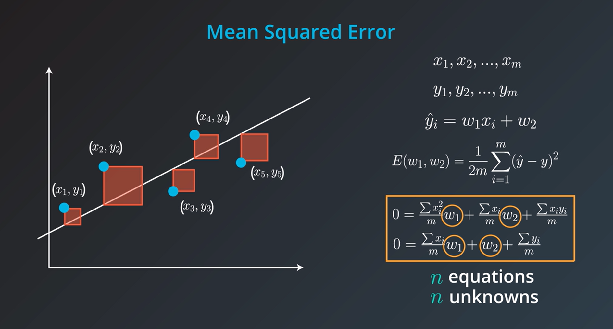
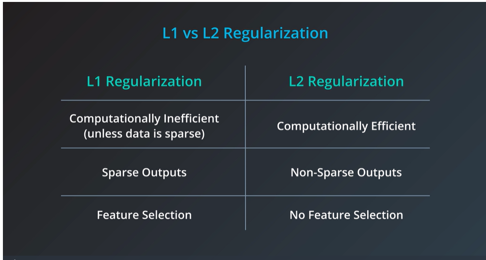

## Lesson Outline
1. Fitting a line through data
2. Absolute Trick
2. Gradient descent
3. Errors
4. Linear regression in Scikit-learn
5. Polynomial regression
6. Regularization
7. Feature scaling


### Fitting a line through data
The line attempts to cut through the points as centrally as possible. It may not be perfect, but it gets as close as possible.

### Absolute Trick
The line equation 
```
y = w1*x + w2
```
Moving lines when the point (p,q) lies above the line 
```
y = (w1 + p*a) + (w2 + a)
```

Moving lines when the point (p,q) lies below the line 
```
y = (w1 - p*a) + (w2 - a)
```

#### What is the purpose of the learning rate?
It is the amount by which we change the y-intercept and the slope. It is a small number.

#### Quiz
Let's say that we have a line whose equation is y = -0.6x + 4. For the point (x,y) = (-5, 3), apply the absolute trick to get the new equation for the line, using a learning rate of alpha = 0.1alpha=0.1.

Report your answer in the form y = w_1x + w_2, substituting appropriate values for w_1 and w_2.

Ans: The point lies below the line as y = 7 when x = -5
So, 
y' = (-0.6 - (-5*0.1))*x + (4 - 0.1)
   = -0.1*x + 3.9


### Square Trick
The line equation 
```
y = w1*x + w2
```
Moving lines to make it come closer to the point (p,q) 
```
y = (w1 + p*(q-q')*a) + (w2 + (q-q')*a)
```
#### Quiz
Let's say that we have a line whose equation is y = -0.6x + 4. For the point (x,y) = (-5, 3), apply the square trick to get the new equation for the line, using a learning rate of alpha = 0.01alpha=0.01.

Report your answer in the form y = w_1x + w_2, substituting appropriate values for w_1 and w_2.

Y' = (-0.6 + (3-7)*(-5)*0.01)*x + (4 + (3-7)*0.01) 
   = -0.4x + 3.96


### Mean absolute error 
Assume we have a point with coordinates (x,y)(x,y) and the line is called Y' since it is our prediction. The corresponding point on the line is (x, y'), and the vertical distance from the point to the line is (y-y'). This is the error.

Error = 1/m*sum(|y-y'|), for all y in the dataset, y' is the prediction

#### Quiz  
Compute the mean absolute error for the following line and points:

line: y = 1.2x + 2

points: (2, -2), (5, 6), (-4, -4), (-7, 1), (8, 14)

Absolute error = 1/5*(())

### Mean Square Error
Assume we have a point with coordinates (x,y)(x,y) and the line is called Y' since it is our prediction. The corresponding point on the line is (x, y'), , but instead of taking the distance between the point and the prediction, we're going to draw a square with this segment as its side. This area is (y− y')^2

Error = 1/2m*sum((y-y')^2), for all y in the dataset, y' is the prediction


### Batch vs Stochastic Gradient Descent
Stochastic - By applying the squared (or absolute) trick at every point in our data one by one, and repeating this process many times.
Batch - By applying the squared (or absolute) trick at every point in our data all at the same time, and repeating this process many times.


### Linear Regression
1. Linear regression assumes the data are linear. Hence, it produces a straight line model from the training data.
2. Linear Regression is Sensitive to Outliers

#### N-dimensions
We have n -1 columns in the input and one in the output. For example, the inputs are size, school quality, number of rooms, et cetera. So for our input, we have n-1 variable names: x1, x2..  up to xn-1mand for the output of the prediction, we only have one variable y'. 
Our prediction would be an n-1 dimensional hyperplane living in n dimensions. Since it's hard to picture n-dimensions, think of a linear equation in n variables, such as  y' = w_1*x_1 + w_2*x_2+...+w_{n -1}* x_{n-1} + w_n.

#### **Can catagorical vatiable be used in linear regression model?**
- https://stats.oarc.ucla.edu/spss/faq/coding-systems-for-categorical-variables-in-regression-analysis-2/


#### Linear Regression Warning
1. Linear regression comes with a set of implicit assumptions and is not the best model for every situation. Here are a couple of issues that you should watch out for.

Linear Regression Works Best When the Data is Linear Linear regression produces a straight line model from the training data. If the relationship in the training data is not really linear, you'll need to either make adjustments (transform your training data), add features (we'll come to this next), or use another kind of model.


2. Linear Regression is Sensitive to Outliers
Linear regression tries to find a 'best fit' line among the training data. If your dataset has some outlying extreme values that don't fit a general pattern, they can have a surprisingly large effect.

### Closed Math Formula



#### Polynomial Regression

Instead of considering lines, we consider higher degree polynomials. This would give us more weights to solve our problem.

For example, in this problem we would solve for four weights; w1, w2, w3, w4. We take the mean absolute or squared error and take the derivative with respect to the four variables and use gradient descent to modify these four weights in order to minimize the error. This algorithm is known as polynomial regression.


### Regularization
it's a very useful technique to improve our models and make sure they don't overfit.

#### L1 regularization
L1 regularization takes the absolute value of the coefficients of the model and adds them to the error. 

#### L2 regularization
L2 regularization is similar to L1 Regularization however instead of adding the absolute values, we add the squares of the coefficients. 

But what if we punish the complicated model too little, or punish it too much?

We can "tune," or alter the amount that we want to punish complex models by using a parameter called lambda.

**The lambda Parameter**
Using lambdaλ, we multiply the error that comes from the complexity of the model to adjust the overall error.



### Feature scaling
Feature scaling is a way of transforming your data into a common range of values. There are two common scalings:

**Standardizing**
Standardizing is completed by taking each value of your column, subtracting the mean of the column, and then dividing by the standard deviation of the column. In Python, let's say you have a column in df called height. You could create a standardized height as:

```
df["height_standard"] = (df["height"] - df["height"].mean()) / df["height"].std()
```

**Normalizing**
A second type of feature scaling that is very popular is known as normalizing. With normalizing, data are scaled between 0 and 1. Using the same example as above, we could perform normalizing in Python in the following way:

```
df["height_normal"] = (df["height"] - df["height"].min()) /     \
                      (df["height"].max() - df['height'].min())
```

#### References 
- https://www.youtube.com/watch?v=iYQbwgBh1aQ

### Lesson Review
In this lesson, you were introduced to linear models. Specifically, you saw:

- Gradient descent is a method to optimize your linear models.
- Multiple Linear Regression is a technique for when you are comparing more than two variables.
- Polynomial Regression for relationships between variables that aren't linear.
- Regularization is a technique to assure that your models will not only fit the data available but also extend to new situations.
