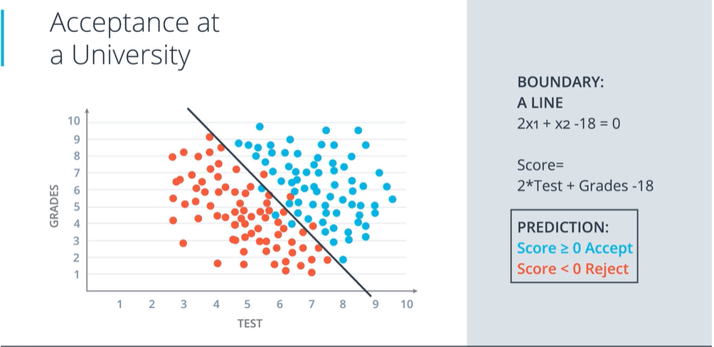

## Lesson outline
- Classification problems
- Linear boundaries
- Higher dimensions
- Perceptrons
- Perceptrons as logical operators

### Classification problems
A predictive modeling problem where a predefined class label is predicted based on training for a given dataset.

